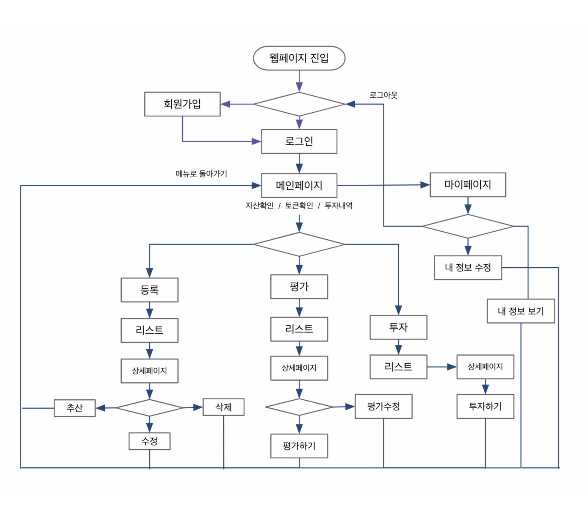
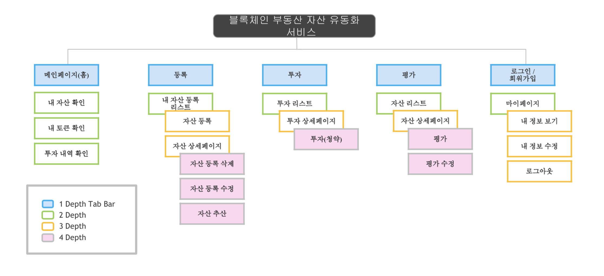

# CLAJWE : 블록체인을 활용한 자산 유동화 플랫폼


<br/>


## 시작 방법

```
git clone https://github.com/hanium-blockchain/clajwe.git

npm install
npm start
```

<br/>


## 시스템 흐름도




<br/>


## 메뉴 구성도




<br/>

## 프로젝트 소개 및 주요 기능

- 자산 등록 : 다양한 자산을 ERC-721 토큰화 하여 플랫폼에 등록함
- 자산평가,토큰발행 : 등록된 자산을 평가하고 이를 기반으로 토큰을 발행함
- 토큰청약, 청산 : 토큰을 청약받고, 계약조건에 따라 다시 청산(수익 발생)한다.
- 토큰교환 : 정의된 교환비율에 의해 다양한 토큰 및 암호화폐와 교환한다.

<br/>


## View


```
|   |-- views
|   |   |-- detail
|   |   |   |-- detail_context.pug
|   |   |   |-- eval_detail.pug
|   |   |   |-- invest_detail_my.pug
|   |   |   |-- invest_detail.pug
|   |   |   |-- liquidation_detail.pug
|   |   |   |-- manager_detail.pug
|   |   |   |-- new_register.pug
|   |   |-- detail_includes
|   |   |   |-- eval_form.pug
|   |   |   |-- invest_form.pug
|   |   |   |-- invest_info.pug
|   |   |-- includes
|   |   |   |-- footer.pug
|   |   |   |-- header.pug
|   |   |   |-- nav.pug
|   |   |-- list
|   |   |   |-- assign_list.pug
|   |   |   |-- eval_invest_list.pug
|   |   |   |-- manager_list.pug
|   |   |-- user
|   |   |   |-- login.pug
|   |   |   |-- mypage.pug
|   |   |   |-- manager_list.pug
|   |   |-- error.pug
|   |   |-- index.pug
|   |   |-- layout.pug
```


<br/>


## DB Models

| Table명    | PK        | FK               |                                                                               |
| ---------- | -------- | ---------------- | ----------------------------------------------------------------------------- |
| Users      | user_id  |                  |name<br/> password<br/> email<br/> is_evaluator<br/> is_manager<br/> createdAt |           
| Hashes     | hash_id  | user_id          |address<br/> prvKey<br/> createdAt<br/> |
| Assets     | asset_id | user_id(등록자)    |value_id<br/> address<br/> category<br/> asseet_no<br/> asset_name<br/> area<br/> completion_date<br/> description<br/> date (등록일자) <br/> end_date<br/> is_evaluate<br/> is_approved<br/> picture<br/> createdAt<br/> |
| AssetTokens  | assettoken_id  | asset_id  | txhash<br/> address<br/> createdAt<br/>                                      |
| Coins      | coin_id  | user_id<br/> asset_id | coin<br/> createdAt<br/>                                           |
| Evaluators | ev_id    | user_id           | is_approved<br/> li_no<br/> li_Category<br/> li_date<br/> li_birth<br/> li_inner<br/> createdAt<br/> |
| Values     | value_id | asset_id<br/>user_id(평가자) | value<br/> value2coin<br/> createdAt<br/>                            |
| Managers     | manager_id |  | address<br/> txhash<br/> value<br/> createdAt<br/>             |


<br/>


**URL**

| Router      | View             | URL                |
| ----------- | ---------------- | ------------------ |
| users       | 로그인             | /users/login        |
|             | 회원가입           | /users/signin       |
|             | 마이 페이지          | /users/mypage       |
| index       | 홈               | /home              |
|             | 로그아웃           | /signout             |
| registers   | 등록 화면         | registers/new      |
|             | 등록 요청         | registers/request_register   |
| investments | 내 투자 리스트     | investments/detail_inv/:id   |
|             | 투자 상세화면      | investments/detail/:id |
|             | 내 투자 상세 화면    | investments/detail_my/:id |
|             | 투자 요청    | investments/request_invest/:id |
|             | 투자 리스트    | investments/list |
| evaluations | 평가 상세 화면      | evaluations/detail/:id   |
|             | 평가 요청    | evaluations/request_eval/:id |
|             | 평가 리스트    | evaluations/list |
| managers    | 관리자 홈 | manager/      |
|             | 평가자 승인      | manager/register       |
|             | 투자 승인      | manager/assign         |
|             | 토큰 생성      | manager/makeToken        |


<br/>


## Contributors

- [최은지](https://github.com/ChoiEunji0114)
- [최리안](https://github.com/leeeeean)
- [정지우](https://github.com/jioo123)
